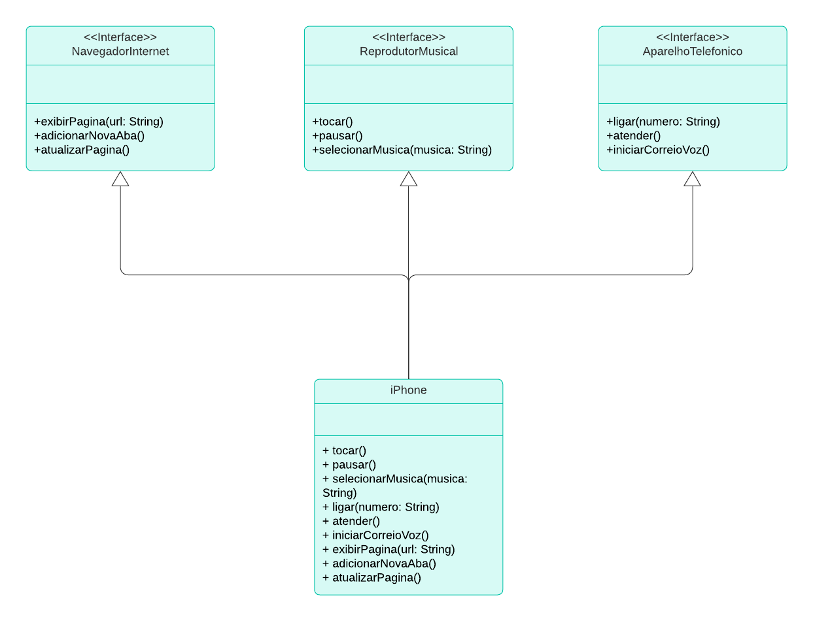

# Bootcamp Santander 2024 - Backend com JAVA
### DIO - Desafio Orientação a Objetos e UML
### Diagramação das classes do iPhone
www.dio.me

## POO - Desafio

Modelagem e diagramação da representação em UML e Código no que se refere ao componente iPhone.
 
## Diagrama do desafio

###### Comportamentos esperados:
* Repodutor Musicial: tocar, pausar, selecionarMusica
* Aparelho Telefônico: ligar, atender, iniciarCorrerioVoz
* Navegador na Internet: exibirPagina, adicionarNovaAba, atualizarPagina
